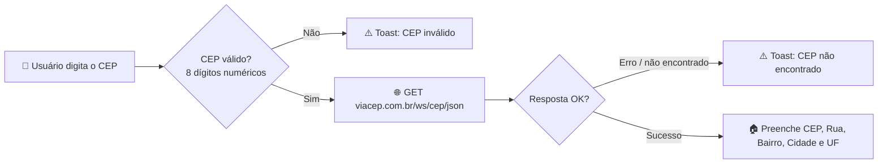

<div align="center">

# 📮 ConsultaCEP

### Aplicativo Android nativo para consulta de endereços a partir de um CEP


</div>

---

## ✨ Sobre o projeto

O **ConsultaCEP** é um app Android desenvolvido em **Kotlin** que permite consultar rapidamente o endereço correspondente a um CEP brasileiro, utilizando a API pública [ViaCEP](https://viacep.com.br/). Simples, direto e funcional — digite o CEP, toque em consultar e pronto.

<div align="center">

| 🔎 Consulta rápida | ✅ Validação de CEP | ⚠️ Tratamento de erros |
|:---:|:---:|:---:|
| Busca o endereço em tempo real | Aceita CEP com ou sem hífen | Feedback claro via `Toast` |

</div>

---

## 🚀 Funcionalidades

- 🔢 Consulta de endereço a partir de um CEP com 8 dígitos
- 🧹 Sanitização automática do CEP digitado (remove `-` e espaços)
- 🏠 Exibição de **CEP, Logradouro, Bairro, Cidade e Estado (UF)**
- 🚫 Tratamento de CEP inválido, CEP não encontrado e falhas de conexão
- 💬 Mensagens de feedback amigáveis para o usuário

---

## 🛠️ Tecnologias utilizadas

| Tecnologia | Uso |
|---|---|
| **Kotlin** | Linguagem principal do projeto |
| **Android SDK** | `minSdk 24` · `targetSdk 36` |
| **Retrofit 2** | Cliente HTTP para consumo da API |
| **Gson Converter** | Conversão de JSON → objetos Kotlin |
| **AppCompatActivity** | Base da tela principal |
| **API ViaCEP** | `https://viacep.com.br/` |

---

## 📂 Estrutura do projeto

```
app/src/main/java/com/example/consultacep/
├── Api/
│   ├── ViaCepClient.kt      # Configuração do Retrofit (base URL e instância do serviço)
│   └── ViaCepService.kt     # Interface com o endpoint da API ViaCEP
└── Model/
    ├── MainActivity.kt      # Tela principal: captura o CEP, chama a API e exibe o resultado
    └── ResponseEndereco.kt  # Data class que representa a resposta da API
```

O layout da tela principal está em `app/src/main/res/layout/activity_main.xml`, contendo o campo de CEP, o botão de consulta e os campos de exibição do endereço.

---

## ⚙️ Como funciona



1. O usuário digita o CEP (com ou sem hífen).
2. Ao tocar em **CONSULTAR CEP**, o app remove hífens/espaços e valida os 8 dígitos.
3. Se válido, é feita uma requisição `GET` para `https://viacep.com.br/ws/{cep}/json/` via Retrofit.
4. A resposta é convertida em `ResponseEndereco` e os campos da tela são preenchidos.
5. Erros de CEP inexistente, formato inválido ou falha de conexão exibem uma mensagem clara ao usuário.

---

## 📋 Pré-requisitos

- [Android Studio](https://developer.android.com/studio) (recente, compatível com `compileSdk 36`)
- JDK 11+
- Conexão com a internet (permissão `INTERNET` já declarada no `AndroidManifest.xml`)

## ▶️ Como executar

**Via Android Studio**

```bash
git clone https://github.com/oliveirajv244/consultacep.git
```

1. Abra a pasta do projeto no Android Studio.
2. Aguarde a sincronização do Gradle.
3. Execute em um emulador ou dispositivo físico com Android 7.0 (API 24) ou superior.

**Via linha de comando**

```bash
./gradlew installDebug
```

## 📦 Dependências principais

```kotlin
implementation("com.squareup.retrofit2:retrofit:2.11.0")
implementation("com.squareup.retrofit2:converter-gson:2.11.0")
```

---

<div align="center">

## 📄 Licença

Este projeto não possui licença definida. Adicione um arquivo `LICENSE` caso deseje distribuí-lo publicamente.

Feito com 💙 usando Kotlin

</div>
